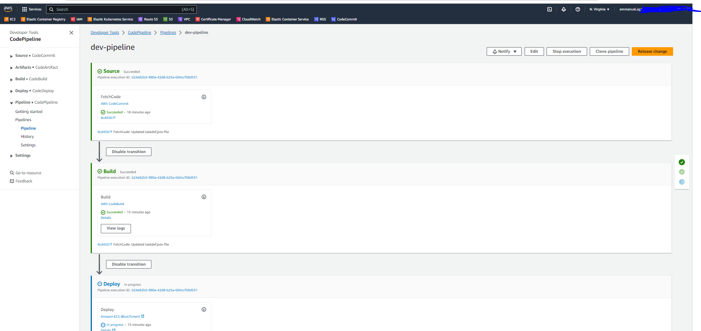

# Terraform Blue Green ECS Fargate

> Deploy an ECS application with Blue/Green deployment, using Terraform, CodePipeline, CodeBild, CodeCommit, and CodeDeploy

## Steps

1. Create a codecommit repo
2. Create a Elastic Container Registry and use the Dockerfile given at repo to create an image and push in to the registry.This image will be used to initially deploy our ECS service
3. Create a file named buildspec.yml in our codecommit repo with the content
4. Create a file named appspec.yml in our codecommit repo with the content
5. Execute the terraform code to create the infrastructure
6. Go to ECS console and copy the task definition json and place it in the codecommit repo as taskdef.json. Make sure to change

`
“image”: “808658323399.dkr.ecr.us-east-1.amazonaws.com/springbootapp”

to

“image”: <IMAGE1_NAME>
`
- Start Codepipeline by pushin updated code to codecommit

- CodeDeploy started shifting traffic

[CodePipeline started runing](./images/codedeploy-start.png)

- CodePipeline completed
[CodePipeline completed](./images/codepipeline2.png)

- Traffic successfully shifted to Blue target group

[CodePipeline started runing](./images/codedeploy-complete.png)